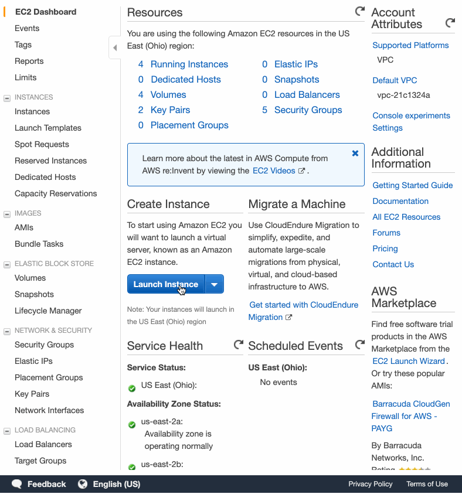
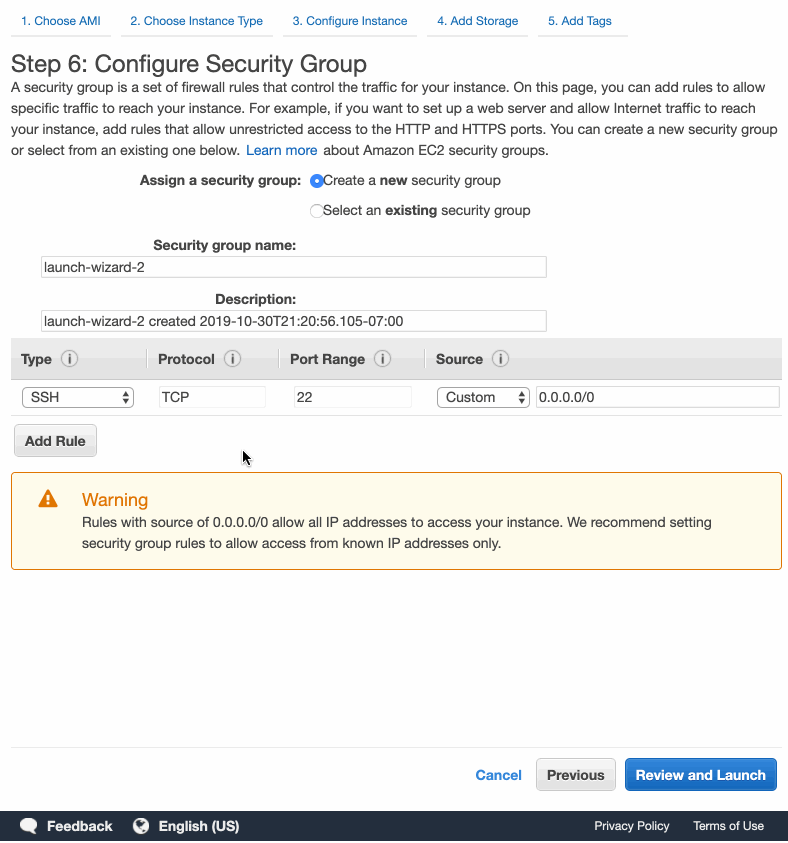

# NGINX + Node.js
Documentation of various nginx configuration and deployment for Node.js.

Supported guides:
- AWS EC2 Ubuntu 18.04 (Bionic)
- AWS EC2 Ubuntu 16.04 (Xenial)

# AWS EC2 Ubuntu 18.04, 16.04
- Open your AWS dashboard and create an AWS EC2 Ubuntu instance.


- Go through all options and leave all settings as default EXCEPT for Configure Security Group.
- Under Configure Security Group, add rules: `HTTP` & `HTTPS`


- Create and download a new key pair to SSH into EC2 instance.
- Navigate to your downloaded key pair file location and run:
```
chmod 400 ./YOUR_KEY_PAIR.pem
```
- SSH into your EC2 instance.
```
ssh -i YOUR_KEY_PAIR.pem ubuntu@YOUR_EC2_PUBLIC_DNS_ADDRESS
```
- Update the server.
```
sudo apt-get update && sudo apt-get upgrade -y
```
### Install Node.js
- Example uses v12.x. 
- Check for up to date version: https://deb.nodesource.com/
```
curl -sL https://deb.nodesource.com/setup_12.x | sudo -E bash -
sudo apt-get install -y nodejs
```
### Install PM2 - process manager for your Node.js app
```
sudo npm i pm2 -g
pm2 start YOUR_APP_FILENAME

# Other pm2 commands
pm2 show server
pm2 status YOUR_APP_FILENAME
pm2 restart YOUR_APP_FILENAME
pm2 stop YOUR_APP_FILENAME

# Show log stream
pm2 logs

# Clear logs
pm2 flush

# To make sure app starts when reboot
pm2 startup ubuntu
```
### Configure firewall
```
sudo ufw enable
sudo ufw status

# port 22
sudo ufw allow ssh

# port 80
sudo ufw allow http

# port 443
sudo ufw allow https
```
### Install and configure NGINX
```
sudo apt install nginx
sudo nano /etc/nginx/sites-available/default
```
- Navigate to this section of `default.conf`; configure domain and reverse proxy.
```
    server_name yourdomain.com www.yourdomain.com;

    location / {
        proxy_pass http://localhost:5000; #whatever port your app runs on
        proxy_http_version 1.1;
        proxy_set_header Upgrade $http_upgrade;
        proxy_set_header Connection 'upgrade';
        proxy_set_header Host $host;
        proxy_cache_bypass $http_upgrade;
    }
```
> Change PORT to your app's PORT. Optional: replace `yourdomain.com` & `www.yourdomain.com` with your own domain name. 

### Check config and restart NGINX
```
sudo nginx -t
```
> return OK
```
sudo service nginx restart
sudo systemctl status nginx
```
### Common commands
```
# check nginx status
sudo systemctl status nginx

# start nginx
sudo systemctl start nginx

# start nginx on startup
sudo systemctl enable nginx

# reload nginx
sudo systemctl reload nginx

# restart nginx
sudo service nginx restart

# show firewall status
sudo ufw status

```

# Databases
Supported:
- MongoDB
- PostgreSQL

## MongoDB
source: https://docs.mongodb.com/manual/tutorial/install-mongodb-on-ubuntu/
> Default PORT: 27017

- Import the public key used by the package management system.
```
wget -qO - https://www.mongodb.org/static/pgp/server-4.2.asc | sudo apt-key add -
```
- Create a list file for MongoDB.
```
echo "deb [ arch=amd64 ] https://repo.mongodb.org/apt/ubuntu bionic/mongodb-org/4.2 multiverse" | sudo tee /etc/apt/sources.list.d/mongodb-org-4.2.list
```
- Reload local package database.
```
sudo apt-get update
```
- Install the MongoDB packages.
```
sudo apt-get install -y mongodb-org
```
### MongoDB Service Commands
```
sudo service mongod start
sudo service mongod stop
sudo service mongod restart
```
- Start mongo shell on same host machine as the mongod.
```
mongo
```
## PostgreSQL
source: https://tecadmin.net/install-postgresql-server-on-ubuntu/

### Enable PostgreSQL Apt Repository
- Import GPG key for PostgreSQL packages.
```
sudo apt-get install wget ca-certificates
wget --quiet -O - https://www.postgresql.org/media/keys/ACCC4CF8.asc | sudo apt-key add -
```
- Add the repository to your system:
```
sudo sh -c 'echo "deb http://apt.postgresql.org/pub/repos/apt/ `lsb_release -cs`-pgdg main" >> /etc/apt/sources.list.d/pgdg.list'
```
### Install PostgreSQL on Ubuntu
```
sudo apt-get update
sudo apt-get install postgresql postgresql-contrib
```
### Connect to PostgreSQL
```
sudo su - postgres
psql
```
- Check login:
```
postgres-# \conninfo
```
- Disconnect from PostgreSQL:
```
postgres-# \q
```
